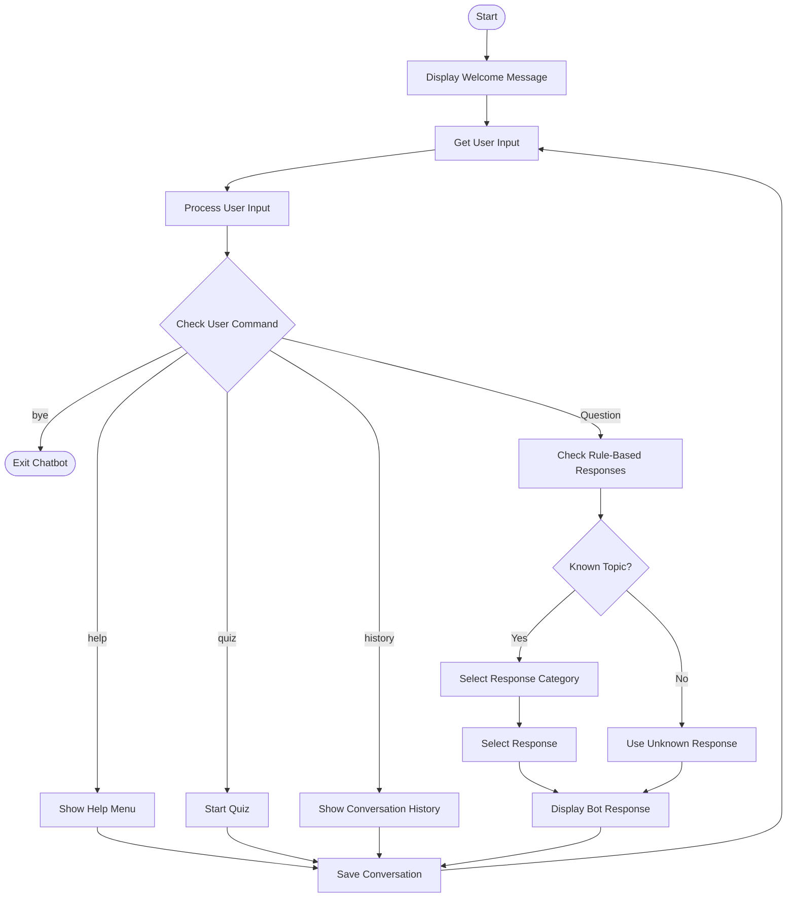

# Rule-Based AI Study Chatbot

A beginner-friendly **rule-based AI chatbot built with Python** to practice fundamental Artificial Intelligence concepts, Python programming, conversational systems, and basic problem-solving techniques.

The chatbot provides predefined responses to questions about **Artificial Intelligence, Machine Learning, Deep Learning, Intelligent Agents, PEAS, and search algorithms**. It also includes randomized responses, conversation history, a help menu, and a basic quiz mode.

---

## Overview

This project was developed as part of my **Artificial Intelligence learning journey**.

The main objective was to take the AI fundamentals I had studied and implement them in a small, practical Python project.

The chatbot uses a **rule-based approach**, meaning that responses are selected according to predefined rules and a dictionary-based knowledge base.

It does **not** use Machine Learning models, NLP models, or Large Language Models.

---

## Features

* Rule-based conversational responses
* Dictionary-based response storage
* Randomized responses
* Interactive help menu
* Conversation history
* AI, ML, and DL explanations
* Intelligent Agent explanation
* Rational Agent explanation
* PEAS explanation
* BFS explanation
* DFS explanation
* Uniform Cost Search explanation
* Greedy Best-First Search explanation
* A* Search explanation
* Basic AI quiz mode
* Exit command
* Modular Python functions
* Interactive command-line interface

---

## AI Concepts Covered

The chatbot can answer questions related to the following concepts.

### Artificial Intelligence

AI stands for **Artificial Intelligence**. It is the field of creating systems that can perform tasks requiring human-like intelligence.

### Machine Learning

Machine Learning is a subset of Artificial Intelligence where computers learn patterns from data and use those patterns to make predictions or decisions.

### Deep Learning

Deep Learning is a subset of Machine Learning that uses **artificial neural networks with multiple layers** to learn complex patterns from data.

### Intelligent Agent

An intelligent agent perceives its environment through **sensors** and takes actions through **actuators** to achieve a specific goal.

### Rational Agent

A rational agent chooses the action expected to maximize its **performance measure**, based on its percept history and available knowledge.

### PEAS

PEAS is a framework used to specify an intelligent agent's task environment.

PEAS stands for:

* **P** — Performance Measure
* **E** — Environment
* **A** — Actuators
* **S** — Sensors

### Search Algorithms

The chatbot provides basic explanations of:

* Breadth-First Search (BFS)
* Depth-First Search (DFS)
* Uniform Cost Search (UCS)
* Greedy Best-First Search
* A* Search

---

## How the Chatbot Works

The chatbot follows a simple rule-based decision process:

1. The user enters a message.
2. The input is converted to lowercase and extra spaces are removed.
3. The chatbot checks whether the input is a command.
4. Commands such as `help`, `quiz`, `history`, and `bye` are handled separately.
5. For questions, the chatbot checks the predefined rules.
6. The matching response category is selected from the response dictionary.
7. A response is selected using Python's `random` module where applicable.
8. The chatbot displays the response.
9. User and chatbot messages are stored in conversation history.
10. The chatbot continues until the user enters `bye`.

---

## Chatbot Flowchart



### Flowchart Explanation

The chatbot first displays a welcome message and accepts input from the user.

The input is processed and checked to determine whether it is a predefined command such as `help`, `quiz`, `history`, or `bye`.

If the input is a question, the chatbot checks its rule-based knowledge base for a matching topic.

* If a matching topic is found, an appropriate response is selected.
* If multiple responses are available, the chatbot can randomly select one.
* If no matching rule is found, an unknown-response message is displayed.
* The interaction is stored in conversation history.
* The chatbot continues accepting input until the user enters `bye`.

---

## Project Architecture

The chatbot follows a simple modular architecture:

```text
                    User
                      |
                      v
                User Input
                      |
                      v
              Input Processing
                      |
                      v
             Command Detection
                      |
          +-----------+-----------+
          |           |           |
          v           v           v
        Help        Quiz       History
          |           |           |
          +-----------+-----------+
                      |
                      v
             Rule-Based Matching
                      |
                      v
             Response Dictionary
                      |
                      v
              Random Response
                      |
                      v
                Bot Response
                      |
                      v
           Conversation History
                      |
                      v
                Continue Chat
                      |
                      v
                User Input
```

---

## Project Structure

```text
rule-based-ai-study-chatbot/
│
├── rule_based_chatbot.py
│   └── Main Python chatbot program
│
├── Screenshots/
│   ├── 01_help_menu.png
│   ├── 02_ai_questions.png
│   ├── 03_quiz_mode.png
│   └── 04_conversation_history.png
│
└── README.md
```

---

## Screenshots

The following screenshots demonstrate the chatbot's main features.

### 1. Help Menu

[](Screenshots/01_help_menu.png)

Click the image to open the full-size screenshot.

### 2. AI Questions

[](Screenshots/02_ai_questions.png)

Click the image to open the full-size screenshot.

### 3. Quiz Mode

[](Screenshots/03_quiz_mode.png)

Click the image to open the full-size screenshot.

### 4. Conversation History

[](Screenshots/04_conversation_history.png)

Click the image to open the full-size screenshot.

---

## Technologies Used

* **Python**
* **Python `random` module**
* **Dictionary-based knowledge base**
* **Command-Line Interface (CLI)**

---

## How to Run

### 1. Clone the Repository

```bash
git clone https://github.com/your-username/rule-based-ai-study-chatbot.git
```

### 2. Navigate to the Project Directory

```bash
cd rule-based-ai-study-chatbot
```

### 3. Run the Chatbot

```bash
python rule_based_chatbot.py
```

The chatbot will start in the terminal.

---

## Example Commands

The chatbot supports commands such as:

```text
help
quiz
history
bye
```

You can also ask questions such as:

```text
What is AI?
What is Machine Learning?
What is Deep Learning?
What is an Intelligent Agent?
What is a Rational Agent?
What is PEAS?
What is BFS?
What is DFS?
What is Uniform Cost Search?
What is Greedy Best-First Search?
What is A* Search?
```

---

## Learning Outcomes

Through this project, I practiced:

* Python programming fundamentals
* Functions and modular programming
* Dictionaries and lists
* Conditional statements
* Loops
* String processing
* Randomization using Python
* Rule-based decision making
* Basic conversational system design
* Command-line application development
* Fundamental Artificial Intelligence concepts
* Implementing theoretical AI concepts in a practical project

---

## Limitations

Since this is a **rule-based chatbot**, it has some limitations:

* It can only respond to predefined topics and patterns.
* It does not understand the actual meaning or context of natural language.
* It cannot learn from new conversations automatically.
* It does not generate new knowledge.
* It cannot handle complex or previously unseen questions reliably.
* It does not use Machine Learning, NLP, or LLM-based models.

These limitations also provide opportunities for future improvements.

---

## Future Scope

The Rule-Based AI Study Chatbot can be further enhanced into a more intelligent and interactive learning assistant.

### Natural Language Processing

Integrate NLP techniques to understand user queries more accurately instead of relying only on predefined keywords and rules.

### Machine Learning Integration

Introduce Machine Learning models that can classify user queries and improve the chatbot's ability to handle different types of questions.

### Large Language Model Integration

Integrate an LLM to provide more detailed, contextual, and natural responses to academic questions.

### Expanded Subject Coverage

Add support for subjects such as:

* Python
* Data Structures and Algorithms
* DBMS
* Operating Systems
* Computer Networks
* Artificial Intelligence
* Machine Learning
* Deep Learning
* Natural Language Processing

### Advanced Quiz System

Improve the quiz system by adding:

* Difficulty levels
* Multiple question categories
* Randomized questions
* Scoring
* Timers
* Performance analysis
* Topic-wise results

### Personalized Learning

Track quiz performance and recommend topics or questions based on the learner's strengths and weaknesses.

### Voice Interaction

Add speech-to-text and text-to-speech functionality for voice-based interaction.

### Web-Based Interface

Develop a modern web interface using technologies such as **HTML, CSS, JavaScript, or React** instead of a command-line interface.

### Database Integration

Store conversation history, quiz scores, user progress, and learning preferences using databases such as **SQLite, MySQL, or MongoDB**.

### AI-Powered Study Features

Future versions could include:

* Automatic summarization
* Flashcard generation
* Question generation
* Study-plan generation
* Concept explanations
* Personalized recommendations

### Multilingual Support

Enable the chatbot to understand and respond in multiple languages, making it accessible to a wider range of learners.

---

## Long-Term Vision

The long-term goal is to transform this simple rule-based chatbot into a complete **AI-powered personal study assistant** capable of understanding natural language, adapting to individual learning patterns, generating educational content, analyzing learning progress, and providing personalized guidance.

---

## Conclusion

This project demonstrates how fundamental Artificial Intelligence concepts can be implemented using a simple **rule-based conversational system in Python**.

Although the chatbot does not use Machine Learning or advanced AI models, it provides a strong foundation for understanding **rules, knowledge representation, decision-making, conversational logic, and basic AI concepts**.

It can serve as a starting point for developing more advanced systems using **NLP, Machine Learning, Deep Learning, and Large Language Models**.
