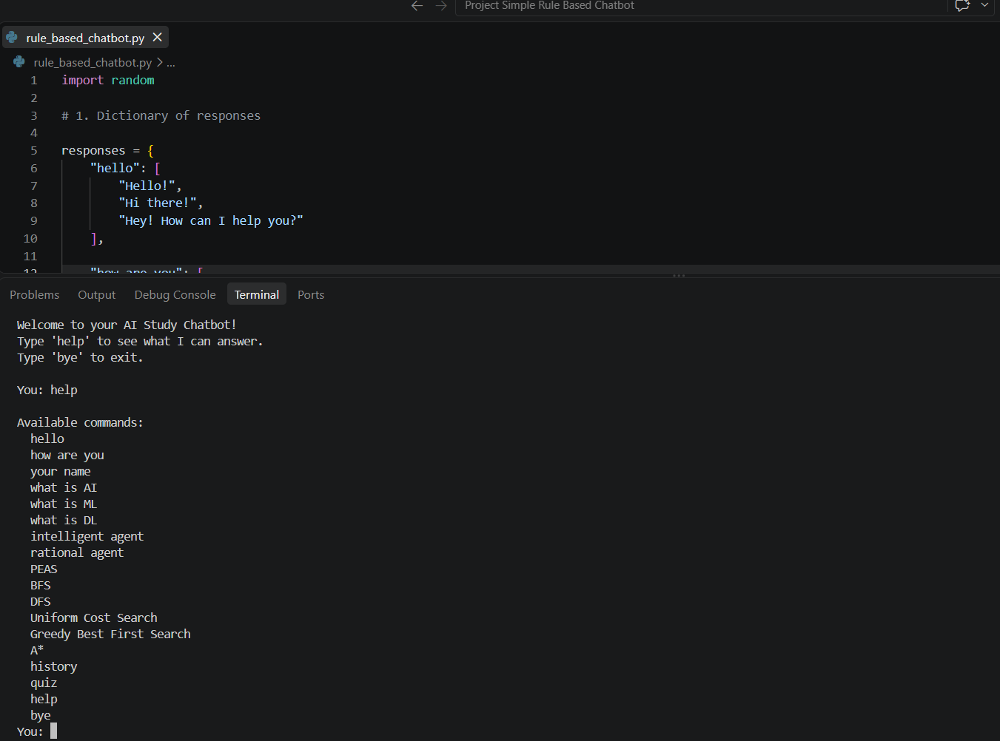
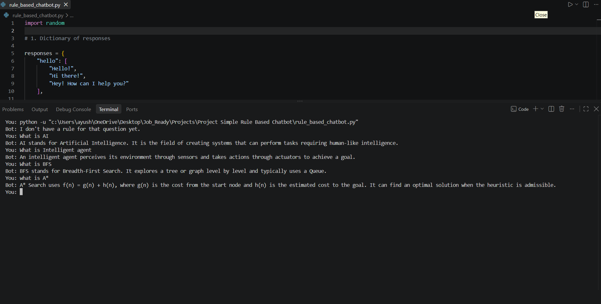
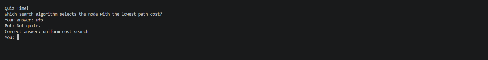
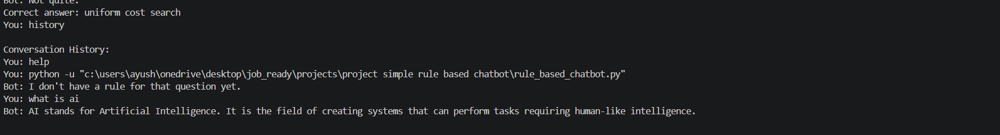

# Rule-Based AI Study Chatbot

A beginner-friendly rule-based chatbot built with Python to practice fundamental Artificial Intelligence concepts, Python programming, conversational systems, and basic problem-solving techniques.

The chatbot provides predefined responses to questions about AI, Machine Learning, Deep Learning, Intelligent Agents, and search algorithms. It also includes randomized responses, conversation history, a help menu, and a basic quiz mode.

---

## Overview

This project was developed as part of my Artificial Intelligence learning journey.

The main objective was to take the AI fundamentals I had studied and implement them in a small, practical Python project.

The chatbot uses a **rule-based approach**, meaning that responses are selected according to predefined rules and a dictionary-based knowledge base.

It does not use Machine Learning, NLP models, or Large Language Models.

---

## Features

- Rule-based conversational responses
- Dictionary-based response storage
- Randomized responses
- Interactive help menu
- Conversation history
- AI, ML, and DL explanations
- Intelligent Agent explanation
- Rational Agent explanation
- PEAS explanation
- BFS explanation
- DFS explanation
- Uniform Cost Search explanation
- Greedy Best-First Search explanation
- A* Search explanation
- Basic AI quiz mode
- Exit command
- Modular functions
- Interactive command-line interface

---

## AI Concepts Covered

The chatbot can answer questions related to the following concepts.

### Artificial Intelligence

AI stands for Artificial Intelligence. It is the field of creating systems that can perform tasks requiring human-like intelligence.

### Machine Learning

Machine Learning is a subset of Artificial Intelligence where computers learn patterns from data.

### Deep Learning

Deep Learning is a subset of Machine Learning that uses neural networks with multiple layers.

### Intelligent Agent

An intelligent agent perceives its environment through sensors and takes actions through actuators to achieve a goal.

### Rational Agent

A rational agent chooses the action expected to maximize its performance measure based on its percept history and available knowledge.

### PEAS

PEAS stands for:

- Performance Measure
- Environment
- Actuators
- Sensors

It is used to specify an intelligent agent's task environment.

### Search Algorithms

The chatbot provides basic explanations of:

- Breadth-First Search (BFS)
- Depth-First Search (DFS)
- Uniform Cost Search (UCS)
- Greedy Best-First Search
- A* Search

---

## How the Chatbot Works

The chatbot follows a simple rule-based decision process:

1. The user enters a message.
2. The input is converted to lowercase and extra spaces are removed.
3. The chatbot checks whether the input is a command.
4. Commands such as `help`, `quiz`, `history`, and `bye` are handled separately.
5. For questions, the chatbot checks predefined rules.
6. The matching response category is selected from the response dictionary.
7. A response is selected using Python's `random` module where applicable.
8. The chatbot displays the response.
9. User and chatbot messages are stored in conversation history.
10. The chatbot continues until the user enters `bye`.

---

## Chatbot Flowchart

The following flowchart represents the overall working of the chatbot:


### Flowchart Explanation

```text
START
  |
  v
Display Welcome Message
  |
  v
Get User Input
  |
  v
Process User Input
  |
  v
Check User Command
  |
  +------ help ------> Show Help
  |
  +------ quiz ------> Start Quiz
  |
  +---- history -----> Show History
  |
  +------ bye -------> Exit
  |
  v
Check Rule-Based Responses
  |
  v
Match Known Topic?
  |
  +------ Yes ------> Select Response
  |                       |
  |                       v
  |                 Random Response
  |                       |
  |                       v
  |                Display Response
  |
  +------ No -------> Unknown Response
                          |
                          v
                   Display Response
                          |
                          v
                   Save to History
                          |
                          v
                    Continue Chat
                          |
                          v
                    Get User Input

## Project Architecture

The chatbot is organized into several simple components:

                    User
                      |
                      v
               User Input
                      |
                      v
              Input Processing
                      |
                      v
             Command Detection
                      |
        +-------------+-------------+
        |             |             |
        v             v             v
      Help          Quiz         History
        |             |             |
        +-------------+-------------+
                      |
                      v
              Rule-Based Matching
                      |
                      v
             Response Dictionary
                      |
                      v
             Random Response
                      |
                      v
              Bot Response
                      |
                      v
           Conversation History

## Project Structure

rule-based-ai-study-chatbot/
│
├── rule_based_chatbot.py
│   └── Main Python chatbot program
│
└── Screenshots/
    ├── [](Screenshots/01_help_menu.png)
    ├── [](Screenshots/02_ai_questions.png)
    ├── [](Screenshots/03_quiz_mode.png)
    └── [](Screenshots/04_conversation_history.png)


## Future Scope

The Rule-Based AI Study Chatbot can be further enhanced into a more intelligent and interactive learning assistant. Possible future improvements include:

* **Natural Language Processing (NLP):** Integrate NLP techniques to understand user queries more accurately instead of relying only on predefined keywords and rules.

* **Machine Learning Integration:** Replace or complement the rule-based system with machine learning models that can learn from user interactions and improve responses over time.

* **Large Language Model (LLM) Integration:** Integrate an LLM to provide more detailed, contextual, and natural responses to academic questions.

* **Expanded Subject Coverage:** Add support for multiple subjects such as Python, DSA, DBMS, Operating Systems, Computer Networks, AI/ML, and other technical subjects.

* **Advanced Quiz System:** Introduce difficulty levels, question categories, randomized questions, scoring, timers, and performance analysis.

* **Personalized Learning:** Track a user's quiz performance and recommend topics or questions based on their strengths and weaknesses.

* **Voice Interaction:** Add speech-to-text and text-to-speech capabilities for hands-free interaction with the chatbot.

* **Web-Based Interface:** Develop a modern web interface using technologies such as HTML, CSS, JavaScript, or React instead of a command-line interface.

* **Database Integration:** Store conversation history, quiz scores, user progress, and learning preferences using databases such as SQLite, MySQL, or MongoDB.

* **AI-Powered Study Features:** Add features such as automatic summarization, flashcard generation, question generation, study-plan creation, and explanation of difficult concepts.

* **Multilingual Support:** Enable the chatbot to understand and respond in multiple languages, making it accessible to a wider range of learners.

### Long-Term Vision

The long-term goal is to transform this rule-based chatbot into a complete **AI-powered personal study assistant** capable of understanding natural language, adapting to individual learning patterns, generating educational content, and providing personalized guidance.


